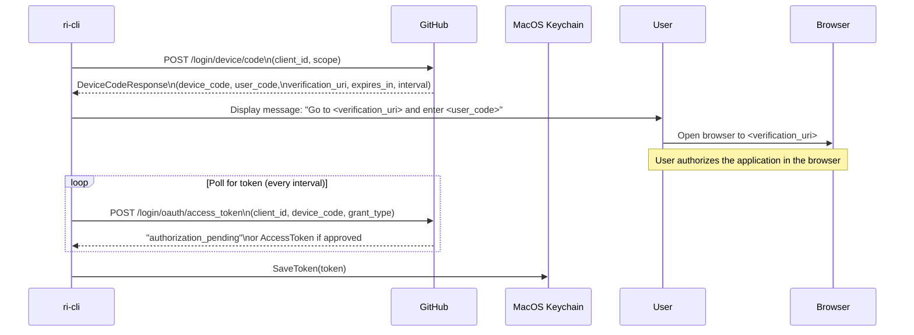
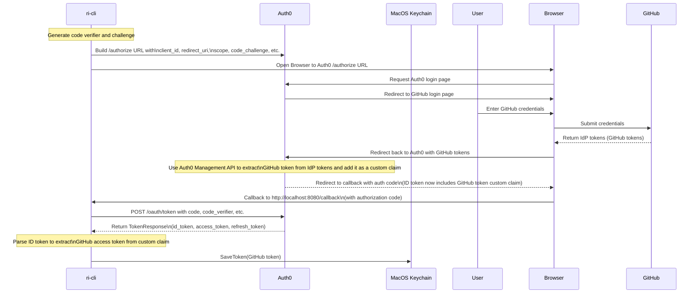

## Overview

Examples of CLI auth flows using GitHub, Auth0, and EntraID.

## authdevice

## authpkce

Assume a couple of things with this PKCE flow:

- User can only login with GitHub via Auth0
- Auth0 runs a post login action to save the GitHub access token as a custom claim on the Auth0 jwt

